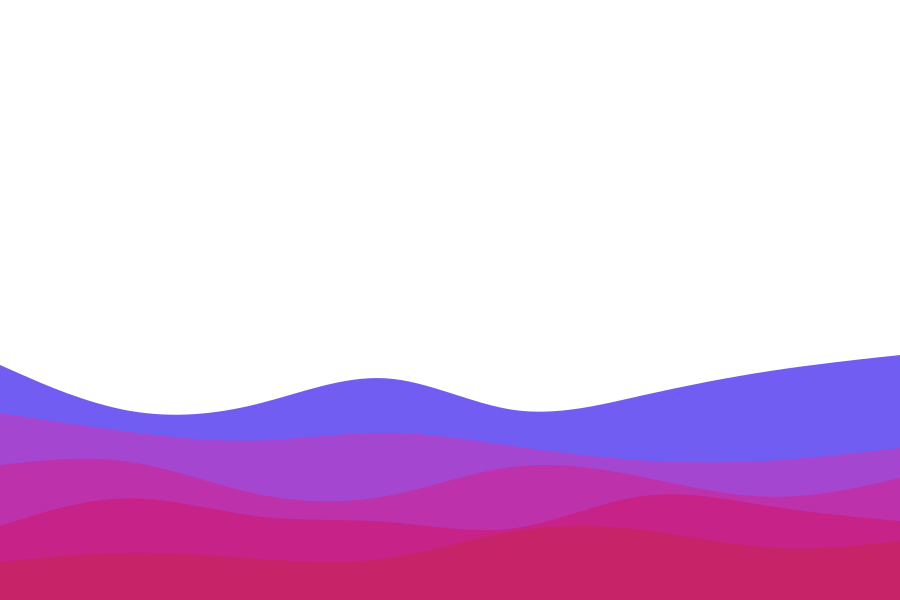

<svg xmlns="http://www.w3.org/2000/svg" viewBox="0 0 1440 320"><path fill="#e7008a" fill-opacity="1" d="M0,288L48,272C96,256,192,224,288,197.3C384,171,480,149,576,165.3C672,181,768,235,864,250.7C960,267,1056,245,1152,250.7C1248,256,1344,288,1392,304L1440,320L1440,320L1392,320C1344,320,1248,320,1152,320C1056,320,960,320,864,320C768,320,672,320,576,320C480,320,384,320,288,320C192,320,96,320,48,320L0,320Z"></path></svg>

### Hi there 👋

<!--
**salim-mrw/salim-mrw** is a ✨ _special_ ✨ repository because its `README.md` (this file) appears on your GitHub profile.

Here are some ideas to get you started:

- 🔭 I’m currently working on ...
- 🌱 I’m currently learning ...
- 👯 I’m looking to collaborate on ...
- 🤔 I’m looking for help with ...
- 💬 Ask me about ...
- 📫 How to reach me: ...
- 😄 Pronouns: ...
- ⚡ Fun fact: ...
-->

---

### 🎤 About Me :

I am a Full Stack Developer from Iraq.
  

- :mailbox: How to reach me: salim.marwan2001@gmail.com

---

### :hammer_and_wrench: Languages and Tools :

  &nbsp;
  &nbsp;
  &nbsp;
  &nbsp;
  &nbsp;
  &nbsp;
  &nbsp;
  

---

### :fire: My Stats :

